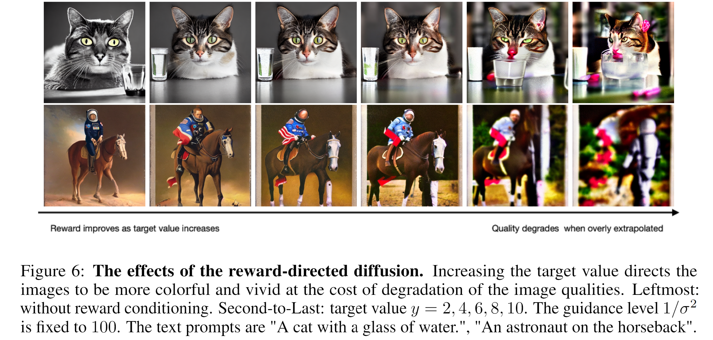

<h1 align='center' style="text-align:center; font-weight:bold; font-size:2.0em;letter-spacing:2.0px;"> Reward-Directed Conditional Diffusion: </br> Provable Distribution Estimation and Reward Improvement </h1>
<p align='center' style="text-align:center;font-size:1.25em;"> 
    Hui Yuan  ,&nbsp; 
    <a href="https://hackyhuang.github.io/" target="_blank" style="text-decoration: none;">Kaixuan Huang</a> ,&nbsp; 
    Chengzhuo Ni  ,&nbsp; 
    <a href="https://minshuochen.github.io/" target="_blank" style="text-decoration: none;">Minshuo Chen</a> ,&nbsp; 
    <a href="https://mwang.princeton.edu/" target="_blank" style="text-decoration: none;">Mengdi Wang</a>
    <br/>  
Princeton University
</p>

<p align='center';>
<b>
<em>NeurIPS 2023</em> <br>
</b>
</p>

<p align='center' style="text-align:center;font-size:2.5 em;">
<b>
    <a href="https://arxiv.org/abs/2307.07055" target="_blank" style="text-decoration: none;">arXiv</a>&nbsp;
</b>
</p>

-----

This repo contains the codes for replicating the experiments in our paper.



### Requirements

```
pip install -r requirements.txt
```


### Usage

1. Randomly generate a ground-truth reward model and the reward labels for CIFAR10 dataset.
```
python3 fake_dataset.py
```
The ground-truth reward model (a ResNet18 model with the final layer replaced by a randomly initialized linear layer) is saved at `reward_model.pth`, and the reward labels are saved at `cifar10_outputs_with_noise.npy`.

2. Train a 3-layer ConvNet (on top of the frozen StableDiffusion v1.5 VAE embedding space) to predict the rewards 
```
python3 train.py 
```
The default config is  `lr = 0.001, num_data = 50000, num_epochs = 100` and can be modified in `train.py`.

3. Perform Reward-Directed Conditional Diffusion using
```
python3 inference.py --target 1 --guidance 100 --num_images 100
```

The following term will be added to each step of the diffusion model. 
$$\nabla_x \log p_t(y|x) = - \text{guidance}  \cdot  \nabla_x \Big[ \frac12 \| \text{target}-\mu_\theta(x)\|_2^2 \Big].$$

## Citation
If you find this useful in your research, please consider citing our paper.

```
@article{yuan2024reward,
  title={Reward-directed conditional diffusion: Provable distribution estimation and reward improvement},
  author={Yuan, Hui and Huang, Kaixuan and Ni, Chengzhuo and Chen, Minshuo and Wang, Mengdi},
  journal={Advances in Neural Information Processing Systems},
  volume={36},
  year={2024}
}
```
